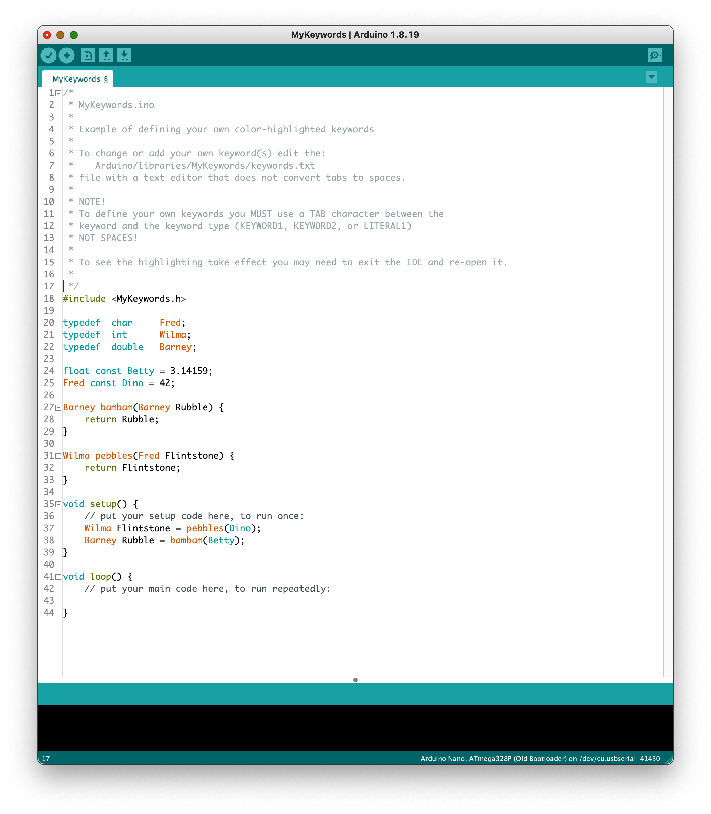

[](https://github.com/marketplace/actions/arduino_ci)
[](https://github.com/ripred/MyKeywords/actions/workflows/arduino-lint.yml)

[](https://github.com/ripred/MyKeywords/releases)
[](https://github.com/ripred/MyKeywords/blob/master/LICENSE)


# MyKeywords Arduino Library

Add your own color highlighted keywords to the Arduino IDE!

This is a simple do-nothing library that allows you to define your own color highlighted keywords without cluttering up any other libraries.
By changing or adding your own definitions to the keywords.txt file you can add your own defined color-highlighted keywords to your Arduio IDE sketches.

To change or add your own keyword(s) edit the:
   Arduino/libraries/MyKeywords/keywords.txt
file with a text editor that does not convert tabs to spaces.

NOTE!
To define your own keywords you MUST use a TAB character between the
keyword and the keyword type (KEYWORD1, KEYWORD2, or LITERAL1)
NOT SPACES!

To see the highlighting take effect you may need to exit the IDE and re-open it.
```
########################################################
# Syntax Coloring Map for Local Arduino Sketches
########################################################
# Datatypes (KEYWORD1)
########################################################
Fred	KEYWORD1
Wilma	KEYWORD1
Barney	KEYWORD1

########################################################
# Methods, Functions, and Globals (KEYWORD2)
########################################################
pebbles	KEYWORD2
bambam	KEYWORD2

########################################################
# Constants (LITERAL1)
########################################################
Betty	LITERAL1
Dino	LITERAL1
```

